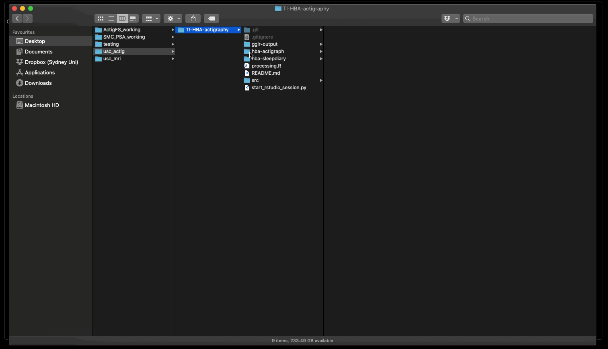

# TI-HBA-actigraphy

Analysis of actigraphy for the Healthy Brain Ageing Clinic at the Thompson Institute, USC.

## General

This pipeline uses GGIR to process raw actigraphy files and sleep diary. The analysis is implemented by running RStudio in a Docker container.

> **NOTE:** This has only been tested on Mac. I've included notes on using Windows from others experience, but there may be some small differences in the commands used or requirements.

## Prerequisites

* Download and install Miniconda for your system (<https://docs.conda.io/en/latest/miniconda.html>)
* Download and install Docker Desktop for your system (<https://www.docker.com/products/docker-desktop>)
* On Windows there are a couple of extra steps if you want to use your local computer for processing
  * Open docker
  * Go to `Settings` > `Resources` > `File Sharing`
  * Add the the analysis directory to the file sharing list

## Build container

When using this pipeline for the first time, the Docker container needs to be built. To do this, change directory to the `TI-HBA-actigraphy/src` folder where the `Dockerfile` is (this is basically a recipe for the container), e.g.:

`cd /path/to/TI-HBA-actigraphy/src`

Then build with:

`docker build -t ggir:r-4.1.0 .`

To check the Docker image is available, type:

`docker images`

and you should be able to see the `ggir:r-4.1.0` image listed.

## Usage

### 1. Input format

* Assumes the raw actigraphy files are named like this:

  `HBA_0001_T1RAW.csv`
  

### 2. Clone/download this repository

* Click on the green 'Clone or download' button on the right and select to download ZIP, which will download the repository to your default downloads location, or select the copy to clip-board option to clone via command line (need git installed for this).

### 3. Copy the data

* Move the data you intend to process into the `hba-actigraph` and `hba-sleepdiary` folders.

### 4. Run

These steps are demonstrated in the clip at the bottom of this page.

#### Mac

* Open a new terminal window and change directory to the downloaded TI-HBA-actigraphy directory, e.g.:

  `cd /path/to/TI-HBA-actigraphy`

* Start the docker container by typing:

  `python start_session.py`

#### Windows

* Open Anaconda powershell prompt (miniconda3) and change directory to the downloaded hba-actigraphy directory.

> **NOTE:** Powershell must be opened as admin - select option "run as administrator" after right click.

* Start the docker container by typing:
  
  `python start_session.py`

> **NOTE:** On Windows, you may get a message in the notification area (bottom right of your screen) that says "Docker wants access to...". You will need to click "Share it" in order for the above step to work.

#### Both

* You will see instructions printed to the terminal screen.
* Following the link will open and RStudio window in your default browser (only tested on Chrome).
* The user name and password are the same.
* Check the file name for the diary and the max number of days is correct.
* When ready, click the `Source` button.

### Walkthrough

